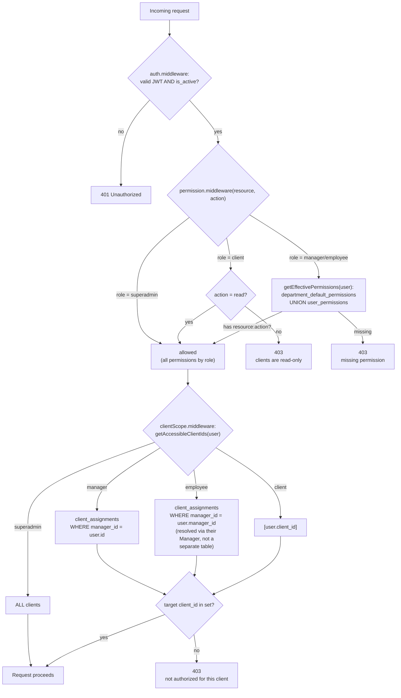
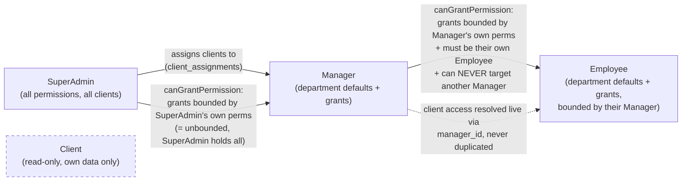

# Client Ops & Campaign Manager -- Backend

An internal API for an ecommerce ops agency to manage clients, storefronts, marketplace accounts,
ad campaigns, and tasks across staff with layered, delegatable permissions.

This repository covers the **backend only** (Node/Express/MySQL/Sequelize). The React/Vite
frontend is out of scope for this pass and will be planned separately against this API.

## 1. Technology Stack

- **Runtime**: Node.js + Express
- **Database**: MySQL 8 (via Sequelize ORM + Sequelize CLI migrations/seeders)
- **Auth**: JWT access tokens (15 min) + rotating refresh tokens (7 days, httpOnly cookie, hashed
  server-side)
- **Validation**: Zod
- **Logging**: Winston (centralized, file + console transports)
- **Tooling**: ESLint + Prettier (enforced pre-commit via Husky + lint-staged)
- **Local infra**: MySQL runs via `docker-compose` (no local `mysql` client required)

## 2. Setup & Installation

### Prerequisites

- Node.js 20+
- Docker + Docker Compose

### Steps

```bash
npm install
cp .env.example .env   # edit ports/secrets if the defaults conflict with something on your machine
npm run db:up          # starts MySQL via docker-compose
npm run db:setup        # runs migrations, then seeds
npm run dev             # starts the API with nodemon
```

The API listens on `PORT` from `.env` (default `4000`) and MySQL is published on `DB_PORT`
(default `3307`). **Both defaults are deliberately non-standard** -- ports `3000` and `3306` were
already in use by unrelated services on the machine this was built on, so `.env.example` maps the
app to `4000` and MySQL to `3307` instead. Adjust freely if your machine is clear on the standard
ports.

Useful scripts:

| Script                            | Purpose                                                                                          |
| --------------------------------- | ------------------------------------------------------------------------------------------------ |
| `npm run db:up`                   | Start the dockerized MySQL instance                                                              |
| `npm run db:migrate`              | Run pending migrations                                                                           |
| `npm run db:seed`                 | Run seeders                                                                                      |
| `npm run db:setup`                | Migrate + seed (fresh setup)                                                                     |
| `npm run db:reset`                | Undo all migrations/seeds and re-run `db:setup` -- gets you back to a pristine, documented state |
| `npm run dev`                     | Start the API with nodemon                                                                       |
| `npm run lint` / `npm run format` | ESLint / Prettier                                                                                |

A pre-commit hook (Husky + lint-staged) runs Prettier (and ESLint `--fix`) on staged files
automatically -- formatting issues are fixed and re-staged before a commit can complete, not just
flagged.

## 3. Default Test Credentials

All seeded users share the password **`Password123!`**.

| Email                    | Role       | Department       | Reports to | Client                         |
| ------------------------ | ---------- | ---------------- | ---------- | ------------------------------ |
| `superadmin@example.com` | superadmin | --               | --         | --                             |
| `manager1@example.com`   | manager    | paid_media       | --         | assigned: Acme Sportswear      |
| `employee1@example.com`  | employee   | paid_media       | manager1   | (via manager1) Acme Sportswear |
| `manager2@example.com`   | manager    | storefront_craft | --         | assigned: Nova Skincare        |
| `employee2@example.com`  | employee   | storefront_craft | manager2   | (via manager2) Nova Skincare   |
| `client1@example.com`    | client     | --               | --         | Acme Sportswear                |
| `client2@example.com`    | client     | --               | --         | Nova Skincare                  |

Seed data also includes 2 clients, 4 departments, 20 permissions (5 resources x 4 actions), a
default-permission matrix per department, one extra `user_permissions` grant on `manager1`
(`task:delete`, beyond their department default) and one Manager->Employee grant (`manager1`
grants `employee1` `task:delete`), plus a couple of sample campaigns and tasks per client so list
endpoints return data immediately.

## 4. API Overview

All routes except `/auth/login` and `/auth/refresh` require `Authorization: Bearer <accessToken>`.

| Resource             | Routes                                                                                                               |
| -------------------- | -------------------------------------------------------------------------------------------------------------------- |
| Auth                 | `POST /auth/login`, `POST /auth/refresh`, `POST /auth/logout`                                                        |
| Clients              | `GET/POST /clients`, `GET/PATCH /clients/:id`, `GET /clients/:id/{campaigns,tasks,storefronts,marketplace-accounts}` |
| Campaigns            | `GET/POST /campaigns`, `GET/PATCH/DELETE /campaigns/:id`                                                             |
| Tasks                | `GET/POST /tasks`, `GET/PATCH/DELETE /tasks/:id`                                                                     |
| Storefronts          | `GET/POST /storefronts`, `GET/PATCH/DELETE /storefronts/:id`                                                         |
| Marketplace Accounts | `GET/POST /marketplace-accounts`, `GET/PATCH/DELETE /marketplace-accounts/:id`                                       |
| Departments          | `GET/POST /departments`                                                                                              |
| Users                | `GET/POST /users`, `GET /users/:id`, `PATCH /users/:id/permissions`, `PATCH /users/:id/status`                       |
| Managers             | `POST /managers/:id/clients`                                                                                         |
| Audit Logs           | `GET /audit-logs` (superadmin only)                                                                                  |

See [`requests.http`](requests.http) (VS Code REST Client format) for an annotated request per
role x route combination -- it's the primary way to exercise and demonstrate every permission
boundary described below without a frontend.

## 5. Assumptions & Design Decisions

### 5.1 Permission resolution model

Effective permissions for a Manager or Employee = **union** of:

1. `department_default_permissions` for their `department_id`
2. `user_permissions` granted directly to them (additive-only, layered on top of the defaults)

**SuperAdmin and Client roles sit outside this system entirely** -- they have no `department_id`
and never receive `user_permissions` rows, so deriving their access from the department/grant
tables would leave them with _zero_ effective permissions. This isn't a workaround; it's the
correct read of the spec's own role table (`SuperAdmin: All permissions`, `Client: Read-only`) --
those are role-level rules, not something the additive department/grant system was ever meant to
express. Both are special-cased directly in `permission.middleware.js` and
`canGrantPermission.js`:

- **SuperAdmin** short-circuits to "always allowed" for every `(resource, action)` check.
- **Client** short-circuits to "allowed" for any `read`, rejected for anything else.

### 5.2 Permission delegation

`canGrantPermission(granterId, permissionId)` is the single function used for **both**
SuperAdmin->Manager and Manager->Employee grants (`PATCH /users/:id/permissions` doesn't branch on
the granter's role beyond the guards below) -- a user can never grant a permission they don't
themselves hold.

Two additional guards run before the grant itself is even considered
(`assertCanManageUser` in `src/utils/assertCanManageUser.js`):

1. **Role guard**: if the granter is a Manager, the target must be role `employee` -- **a Manager
   can never modify another Manager's permissions**, regardless of `manager_id` values. This was an
   explicit requirement: the check is a direct role comparison, not inferred from the reporting
   chain, so it holds even against malformed data.
2. **Ownership guard**: if the granter is a Manager, the target Employee must actually report to
   them (`target.manager_id === granter.id`).

SuperAdmin bypasses both guards.

### 5.3 Client-access cascade

An Employee's accessible clients are **never** stored on a per-employee row -- they're resolved
live through their Manager's `client_assignments` at query time
(`getAccessibleClientIds` in `src/utils/getAccessibleClientIds.js`). This guarantees an Employee
can never see a client their own Manager isn't assigned to, without a second, separately-maintained
check that could drift out of sync.

Client-scope and permission checks are always **two separate steps**, never combined into one
condition (`permission.middleware.js` and `clientScope.middleware.js` are independent middleware).
A Manager can hold `campaign:create` generally and still be 403'd creating a campaign for a client
they aren't assigned to.

List endpoints (`GET /clients`, `GET /campaigns`, etc.) **filter** by accessible client ids rather
than gating the whole route -- every role can call them, results just differ by scope. Single-
resource routes (`GET /campaigns/:id`, etc.) 403 outright if the resource's `client_id` isn't
accessible.

### 5.4 Soft delete only -- no hard deletes anywhere

Every domain model (`Client`, `Storefront`, `MarketplaceAccount`, `Campaign`, `Task`, `User`, and
the `client_assignments` / `user_permissions` join tables) is `paranoid: true` with a `deleted_at`
column. Every "delete" route issues an `UPDATE ... SET deleted_at = NOW()`, never a real `DELETE`.

Two consequences worth calling out:

- **FKs use `ON DELETE RESTRICT`** everywhere a real delete would otherwise cascade, since a real
  delete should never happen through the app in normal operation.
- **Re-adding a soft-deleted grant/assignment restores the row instead of inserting a duplicate.**
  `client_assignments` and `user_permissions` both have unique indexes that persist across
  soft-deletes by design (re-assigning a client to a manager, or re-granting a permission, after a
  prior soft-delete calls `.restore()` on the existing row -- see `managers.service.js` and
  `users.repository.js#grantPermission`).

  **Sequelize gotcha found while building this**: `timestamps: false` combined with
  `paranoid: true` silently disables soft-delete (`.destroy()` falls back to a real `DELETE`)
  because Sequelize needs `timestamps` enabled to register the `deletedAt` attribute correctly.
  The `Campaign` model hit this (its table has no `created_at` per the spec's schema) and is fixed
  by disabling `createdAt`/`updatedAt` individually instead of `timestamps` wholesale -- see the
  comment in `src/models/campaign.model.js`.

### 5.5 User deactivation & cascade

Every user has an `is_active` flag (`PATCH /users/:id/status`, guarded by the same
`assertCanManageUser` check as permission delegation):

- **Deactivating a Manager cascades** to `is_active = false` on every Employee reporting to them,
  in a single transaction.
- **Deactivation immediately revokes access**, not just future logins: the stored refresh token is
  deleted (no more silent refreshes) **and** `auth.middleware` re-checks `is_active` live on every
  request, so an already-issued access token is rejected on its very next use rather than being
  honored until its natural 15-minute expiry.
- **Reactivation is never auto-cascaded** -- flipping a Manager back to active does not
  automatically reactivate their Employees; each is a separate, explicit action, since they may
  have been deactivated independently.
- **Tasks are left untouched** on deactivation -- no automatic reassignment. That's a deliberate
  scope boundary: this build handles the auth/access side of deactivation, not downstream business
  workflow (reassignment is a manual follow-up action for a SuperAdmin/Manager).

### 5.6 Refresh tokens: DB-backed now, Redis planned next

Refresh tokens are stored hashed (SHA-256) in a `refresh_tokens` table, one active row per user
(a new login overwrites the previous token -- a documented simplification vs. true multi-device
session tracking). **This is explicitly an interim choice**: a production version of this service
should move refresh-token storage to Redis, which gives natural TTL-based expiry instead of manual
`expires_at` bookkeeping and doesn't need soft-delete semantics (sessions aren't an audit-relevant
record the way domain data is).

### 5.7 Centralized error logging

Every error -- HTTP-layer and process-level -- flows through one Winston logger
(`src/utils/logger.js`), never an ad-hoc `console.error`:

- `error.middleware.js` logs every error that reaches it (`warn` for expected 4xx `ApiError`s,
  `error` for unhandled 5xx), tagged with a per-request id, user id, method, path, and status --
  stack traces go to the log, never the HTTP response body.
- `server.js` wires `unhandledRejection` and `uncaughtException` through the same logger, so a
  process-level crash is captured the same way an HTTP error is, not via a separate code path.

### 5.8 Scope trade-off: revocation of specific default permissions (designed, not built)

`user_permissions` is **additive-only by design** -- there is no way to revoke a single department
default permission from one specific user without affecting the whole department. A production
version of this schema would add a `type ENUM('grant', 'revoke')` column to `user_permissions` so
an override could subtract as well as add. This is stated here as a deliberate scope decision for
this build, not an oversight.

### 5.9 Other scope notes

- Account **creation** (`POST /users`) is SuperAdmin-only in this build -- Managers can grant
  permissions and toggle status for their own Employees, but don't provision new accounts. The
  spec's delegation requirements only cover permission grants and (per the additions in this
  pass) status changes, not account creation.
- `department`/`user` are **not** modeled resources in the `permissions` table (unlike
  `client`/`storefront`/`marketplace_account`/`campaign`/`task`) -- they're the administrative
  scaffolding the permission system itself runs on, so routes touching them are role-gated
  directly rather than via `getEffectivePermissions`.
- Composite unique index added beyond the raw spec: `permissions(resource, action)`, preventing
  duplicate permission rows.

## 6. RBAC Flow





## 7. Folder Structure

```
src/
  config/              # env validation, Sequelize CLI config
  middleware/           # auth, permission, clientScope, validate, error, request-id
  models/                # Sequelize models (one file per table)
  database/
    migrations/          # one migration per table, FK-safe order
    seeders/              # departments, permissions, defaults, clients, users, assignments, grants, sample data
  modules/
    auth/ users/ departments/ clients/ storefronts/
    marketplaceAccounts/ campaigns/ tasks/ managers/ auditLogs/
      # each: *.controller.js / *.service.js / *.repository.js / *.routes.js / *.validation.js
  utils/
    ApiError.js, logger.js, parseDuration.js, recordAudit.js
    getEffectivePermissions.js, getAccessibleClientIds.js, canGrantPermission.js,
    assertCanManageUser.js, scopedClientWhere.js
  app.js
  server.js
```

Controllers stay thin: route -> validate -> service -> response. The repository layer isolates
Sequelize/DB access from business logic in each module.

## 8. Deploying to Render

`render.yaml` deploys **one** service, on Render's **free** plan: the Node app and MySQL both run
inside a single container (`Dockerfile` at the repo root).

**No Persistent Disk, by deliberate choice.** Persistent Disks require a paid instance type on
Render, full stop -- there's no free-tier way around that if MySQL's data needs to survive a
restart. This deployment prioritizes staying free over that guarantee:

- **MySQL's data does not survive a redeploy, or a free-tier cold start.** Render spins free web
  services down after ~15 minutes of inactivity; the next request wakes it back up in a fresh
  container with an empty `/var/lib/mysql`. `start.sh`'s seed guard means every cold start comes
  back up to the exact same pristine, documented seed state -- but anything created or changed
  since the last boot (a new campaign, a permission grant, a deactivated user) is gone. Fine for
  "here's a live demo, click around" or "review the API against the documented seed data"; **not**
  fine for anything that needs to persist between sessions.
- Cold starts are also slower than a typical free Render service, since the boot sequence
  re-initializes MySQL, runs all 13 migrations, and re-seeds from scratch every time -- expect the
  first request after idle to take noticeably longer than a normal cold start.
- If persistence turns out to matter later, the two ways back are: (a) add a Persistent Disk and
  move to a paid plan (uncomment the trade-off documented in git history / re-add `disk:` +
  `plan: starter` to `render.yaml`), or (b) point at a free external managed MySQL instead and drop
  back to a plain Node web service (no Docker needed at all) -- worth a fresh look at what's
  currently offered rather than assuming a specific provider's terms haven't changed.

**Memory is also tight and was tuned for it, not just assumed to fit.** Render's free instance is
512MB RAM / 0.1 CPU, shared between MySQL and Node -- MySQL's out-of-the-box defaults (128MB InnoDB
buffer pool, `performance_schema` instrumentation, etc.) can alone eat 300-400MB, leaving too
little for Node. `start.sh` starts `mysqld` with a reduced footprint
(`--innodb-buffer-pool-size=64M --performance-schema=OFF --key-buffer-size=8M
--table-open-cache=64 --max-connections=20`), trading query/connection throughput that a
single-digit-users demo doesn't need for a much smaller baseline. Verified locally under an actual
`--memory=512m --memory-swap=512m` cap (matching Render's free instance, not just assumed): the
container stayed around **177-178MB (~35%) at idle and after a login request**, well inside budget.

**Single container is also not the default recommendation independent of cost.** Running MySQL as
its own Render service (native Node web service + a separate Docker-based MySQL private service)
is the more resilient shape -- a crash in one process can't take down the other, and each
restarts/scales independently. Single-container was chosen anyway for simplicity (one service to
provision, no cross-service networking to configure).

### How the container boots (`deploy/single-container/start.sh`)

1. Ensures `/var/lib/mysql` is owned by the `mysql` system user.
2. Clears any stale MySQL socket/lock/pid files left behind by a prior unclean shutdown --
   **found while testing this locally**: without this, a container that gets force-killed (see
   below) refuses to start MySQL on its next boot with `Another process ... is using unix socket
file`, even though nothing is actually still running.
3. If `/var/lib/mysql/mysql` doesn't exist yet, runs `mysqld --initialize-insecure` and then sets
   the root password + creates the app's database and user from env vars. **Without a disk, this
   branch runs on every single boot** -- there's no "later boot" where it gets skipped, since
   nothing survives between container instances.
4. Starts MySQL in the background, waits for it to accept connections, then hands off to
   `npm run render-start` (migrate -> conditional seed -> `node src/server.js`), running that in
   the background too and `wait`-ing on it so `docker stop`/Render's restart signal reaches it
   promptly (see below for why that distinction mattered).

### Why Ubuntu, not Debian, as the base image

`node:20-slim` (Debian) was the first instinct, but Debian's default MySQL package resolves to
**MariaDB**, not real MySQL -- Ubuntu still packages genuine `mysql-server` 8.0. Since the rest of
this project (local dev, the design decisions in §5) is built and tested against real MySQL, the
base image is `ubuntu:22.04` with Node.js installed via NodeSource on top, rather than the more
common "start from the Node image" approach.

### Bugs this surfaced that are worth knowing about

Building and locally verifying this (via `docker build` + `docker run`, not just reading the
Dockerfile) turned up two real, non-obvious failures:

- **Ubuntu's `mysql-server` package auto-initializes a default data directory during `apt-get
install`**, even with service auto-start blocked (`policy-rc.d` returning 101, the standard trick
  for apt-installing a service package with no init system present). That baked-in datadir meant
  the image shipped with `/var/lib/mysql/mysql` already present, so `start.sh`'s "is this the first
  boot?" check found it pre-initialized and **skipped creating the app's database user entirely** --
  the app failed with `Access denied for user 'app_user'@'localhost'` on first deploy. Fixed by
  explicitly wiping `/var/lib/mysql` in the `Dockerfile` after installing the package, so the image
  ships genuinely empty there regardless of what the package's postinstall script did.
- **`docker stop` was taking the full ~10s grace period and then force-killing the container**
  (exit code 137), because bash defers running `EXIT`/`TERM` traps until the current _foreground_
  command finishes -- and the foreground command was `npm run render-start`, which runs
  indefinitely (it's serving HTTP). Fixed by backgrounding that final step too and using `wait` on
  it explicitly, which bash _does_ interrupt promptly on a trapped signal. This is also what
  surfaced the stale-socket bug above: the force-kill left MySQL's socket/lock files in a state
  that blocked the next startup.

### Why migrate + seed run inside the start command, not a pre-deploy step

Render's `preDeployCommand` (the "textbook right" place for this) **requires a paid instance
type**. `npm run render-start` instead runs `db:migrate && seed-if-needed.js && server.js` every
boot, which works on any plan:

- **Migrations are naturally idempotent** (Sequelize tracks applied migrations in `SequelizeMeta`),
  so re-running them against a database that already has them is harmless -- confirmed locally
  against a disk-backed test run, where a restart's log showed "No migrations were executed,
  database schema was already up to date." On this free/no-disk deployment specifically, that
  branch doesn't actually get exercised in practice (there's no persisted schema to already be up
  to date with), but the guarantee is what makes it safe to unconditionally run migrate on every
  boot regardless of which deployment shape is in use.
- **Seeders are not** idempotent by default (`bulkInsert` with fixed ids would throw duplicate-key
  errors on a second run) -- `src/database/seed-if-needed.js` guards this by checking whether
  `departments` already has rows before seeding. On this deployment, that check will (almost)
  always find zero rows and reseed, for the same reason.

### Cost note

`client-ops-api` is on Render's `free` plan -- $0, no payment method required. The trade-off for
that is the one described above: no Persistent Disk, so MySQL's data doesn't survive a
redeploy/cold-start. This was a deliberate choice to stay free rather than a default -- see the
top of this section for what it costs functionally, and the fallback options if that stops being
an acceptable trade-off.

### Seeded demo credentials are public

The password for every seeded account (`Password123!`) is printed in this README and in
`requests.http`. That's intentional for a reviewable assessment deployment, but it means **this
seed data should never be treated as a real production dataset** -- don't reuse this deployment
pattern as-is for an app with real client data without replacing the seed step with something that
doesn't ship known credentials.
